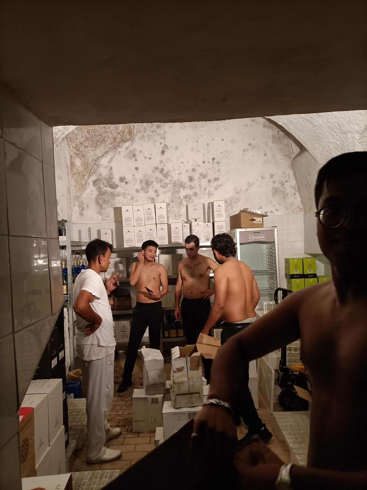
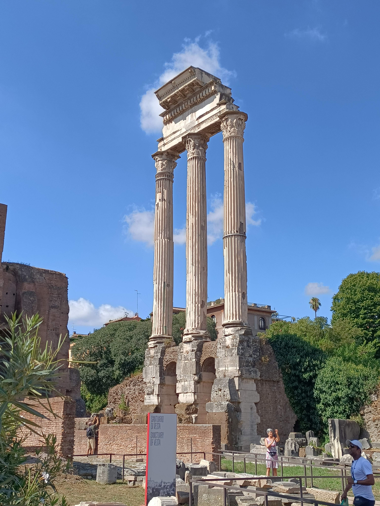

## Ségra a nudle

Navštěvuje mě sestřička, se kterou bydlím dvě noci v hotelu, kde si užívám pohodlnou postel, parádní snídaně a nachlazení z klimatizace (tato informace se ještě bude později hodit, zapamatovat!). Dopoledne máme úplně turistický program - prohlídka Kolosea s průvodcem, lekce dělání italských těstovin, italské víno. Užíváme si společný čas, mám radost že se s někým můžu bavit česky.

## Setkání s dobrodruhy

Setkávám se s dobrodruhy [Lukášem](https://www.instagram.com/lukahulenka/) a [Tomášem](https://www.instagram.com/tomhanzlik7/), kteří pěšky dorazili z Ostravy. Setkáváme se u mě v restuaraci, dělám jim koktejla. Luky mi dělá videa jak dělám espresso Martini, takže už mám něco co můžu ukazovat babičkám. Luky s Tomem bydlí u klučiny z Yes theory (Fede) a domlouváme se, že po mé směně vyrazíme do města a já potom přespím u Fedeho. V tento večer ještě potkávám italskou kamarádku Giuliu (což je kamarádky od kamarádky z Brna) a její kamarádku Sofii. Bavíme se o škole, Češích, Italech, Česku, Itálii, Češkách, Italkách a tak dále. Domlouváme se, že podnikneme nějaký výlet. Z toho mám radost, protože z celého Říma znám zatím akorát tak Trevi fountain, restauraci, bus a Johnovu postel.

Potom se setkávám s Lukym, Tomem a Fedem, kteří sedí na schodu v pochybné Římské čtvrti a vypadají úplně zničeně. Po pěším 1500km výletě se jim teda nedivím. Divím se trochu Fedemu, u kterého kluci spí. Oni leží na stole a on stále vymýšlí, kde bude pokračovat párty. Zajímavý hostitel.

Dostáváme se k němu domů a asi poprvé v životě spím vyloženě na zemi. Vyspal jsem se do růžova. (Vážně.)

### Mexičan, Turek, Ital, Němec, Američan a Čech jdou na večeři

Přes Yes theory chat se domlouváme na večeři s pár náhodnými lidmi a konverzujeme. Probíráme kultury, proč jsou Američani hloupí a tak dále. Turek vysvětluje, že má plno příležitostí na sehnání investorů a že má hodně peněz, protože v Turecku založil firmu na podporu lokálních podnikatelek, což je teď v Turecku trend. Takže stačí nakupovat produkty od lokálních výrobkyň a prodat je za 9x více. Říká mi, že mi závidí, že si můžu dovolit jen tak jet do zahraničí dělat barmana. To on nemůže, protože je příliš úspěšný podnikatel.

## Nový hostel

Nacházím parádní hostel "Yellowsquare Rome", je tu plno mladých, levný bar, příjemné postele a coworking (kdyby tu z vás někdy někdo jel, tak kód do coworkingu je #702290#). Jsem tady na 3 noci.

## Práce

V práci se neděje nic nového, nikdo neříká nic nového, všichni mají stejně negativní/pozitivní emoce, jaké mají vždycky, a mají stále stejné problémy.

## Jsem nemocen

Jak jsem zmínil, po návštěvě hotelu jsem jakýs nachlazený a v úterý, 6. 9. se probouzím s ucpaným nosem, suchým kašlem a chutí celý den ležet v posteli. Píšu Utschovi (což je jediný z práce, na koho mám kontakt), že mám kašel a že mi není dobře, tak jestli mám chodit do práce.

Uvědomuji si důležitost zprávy, tak všechno pečlivě překládám v Google překladači a kontroluji, že vyjadřuji co chci vyjádřit. Utscho odepisuje (viz obrázek výše) "Dnes nechoď do práce", "Přijď na Náměstí Vittorio". Asi nepochopil situaci, tak mu ještě jednou píšu, že mi nejde o vyhýbání se práci, ale že si akorát nejsem jistý jestli je dobrý nápad chodit do práce když kašlu (protože covid..)

Utscho píše že Vincenzo (šéf) říká, že nemám chodit. A potom přichází zvrat.

Když potvrzuju zprávu a Utscho neodepisuje, tak se ptám, jestli se něco stalo. On odepisuje:

**"Řekni Michalovi, že už tady nepracuje"**. Jsem šokován, zmaten, překvapen ale zároveň si říkám, že by mi zas tak nevadilo mít o něco více volného času na objevování Říma. Vypadá to, že zítra půjdu do restaurace abych zjistil, co se děje. Celý den polehávám, odpočívám, dělám si covid test (negativní) a kupuju si sirup na kašel.

## Návštěva restaurace

Další den se cítím mnohem lépe a jdu klasicky na 17h do práce. Potřeboval jsem akorát spánkovou desetihodinovku. Přicházím do restaurace, zdravím. Utscho i Francesco se vyhýbají přímému pohledu a říkají mi, že se mám pobavit s šéfkou (Signora Marcella). Tak tedy čekám na siňóru Marcellu, až mi řekne co se děje. Řeší něco s jednou z kuchařek, která u jejich rozhovoru dvakrát brečí. Rozumím, že se Marcella párkrát snaží rozhovor ukončit slovy, že se pobaví ještě zítra, že si teď musí promluvit tady z chlapcem. Zbytek se snažím neposlouchat a co poslouchám, tak tomu stejně nerozumím. Každopádně sedím na židličce, popíjím vodu a čekám v restauraci HODINU, než na mě siňóra Marcella bude mít prostor. Je 18h, kuchařka ukazuje plno fotek jídel, která vařila, jejich dcer a na konci se se siňórou objímají, ta se potom zvedá a jde pryč.

Já jdu tedy za ní a říkám že mám jednu jedinou otázku - mám zítra přijít do práce nebo ne? Ta mi říká, že neví, že se musí zeptat svého syna (Vincenzo). Ale že zítra si mám dát volno a že mám zavolat, zítra mi po telefonu vysvětlí co a jak.

Jdu tedy zpátky na hostel a potkávám se s Američanem z Kalifornie (21) a Američankou z New Jersey (20). Asi 2h řešíme vztah štěstí a peněz a co je v životě důležité, je zajímavé srovnávat hodnoty, pohledy a perspektivy. Já potom navrhuji, že můžeme zajít na drink do restaurace kde pracuju (jsem pracoval), že je zvu. Jsem trochu zvědavý, jak vítán budu.

Dáváme si tři drinky a tři bruschetty a platím 15€ (což znamená že jsem dostal pořádnou slevu) (od paní Marcelly). Potom jdeme zpět do Yellow baru a otestovat místní klub. Je to nic moc. Po sléze zjišťujeme, že nám na pokoji přibyla nějaká holčina z Londýna. Ta říká, že dostala slevu, protože zemřela Králova.

## Volný den

Giulia mě pozvala na vejlet k jezeru s jejími rodiči. Jedeme malinkatým, starším Fiatem 600 a je to naprosto kouzelný výlet. Nikde nikdo, plácáme se u jezera, dostávám panini s proscuittem, pronajímáme šlapací lodičku (platím!), dáváme si gellato a snažíme se komunikovat. Oni na mě mluví jednoduchou italštinou, já mám strašně moc otázek jak co v tomhle jazyce funguje. Jsem trochu nervózní, že mám celý den dělat nic.

Večer mě zvou na aperitif, protože Giuliin tatínek (Nicollas) má dneska narozeniny. Před aperitivem volám do restaurace, Marcella zvedá, ptá se mě kdy odjíždím, říkám že ze týden a ona mi říká, že tak to ať už nechodím. Je to trochu smutně příliš krátké rozloučení, ale jsem rád že mám více času na poznávání Říma.

Nicolassovi kupuju mu bílé víno Fallanghino a zůstávám na aperitif. Říkají, že mají syna na skautském táboře, takže mám přespat u nich. Cítím se provinile, že mě pozvali na výlet, celý den mě krmili (jak jídlem tak lekcemi italštiny) a teď bych měl u nich spát. Vymýšlím tedy, že si dám poslední noc na hostelu (až na to že nemám rezervovaný pokoj) a potom že můžu být u nich.

V Yellow je všechno zabráno, takže spím na gaučíku.

## Co John?

Možná se divíte, že už nejsem u Johna. Měli jsme totiž zajímavou konverzaci. Asi týden zpět mi před spaním řekl, že mi ráno o sobě musí něco říct. Já vyzvídám, on nic neprozrazuje, trochu se bojím jestli se dostanu přes tuto noc a jdu spát. Ráno mi píše "relationship can be sometime between people of same gender". "even myself up until now still learning what to do and how to accept it,, since sometimes I need like to hug boy"

Večer mu říkám, že kašlu a že mě bolí hlava, dává mi čaj, nabízí masáž, já odmítám, nabízí mi znovu, odmítám, nabízí mi masáž jenom krku, odmítám, jde ke mě že mi udělá masáž krku, tak odmítám opět. Vysvětluje, že když budu mít "oil on my body", tak že se budu moct vypotit. Snažím se mu co nejslušněji vysvětlit, že OPRAVDU masáž nechci. Nabízí mi chleba (😂). Asi je ochoten udělat kompromis, píše, že si mám dát "oil to my chest and neck,, make you warm". Potom se mi daří změnit téma. Nic se neděje, masáž neproběhla a olej nevyužit. Další den si u něj ale nechávám mikinu a špagety (obojí mám s sebou od prvního dne a obojí jsem od prvního dne nepoužil) a říkám mu, že teď budu pár dní bydlet jinde.

Za 2 dny spolu jdeme na oběd. Říká, že potřebuje pomoct. Otevřeně sdílí, že je zmatený z vlastní orientace, a že je tady v Římě sám a že by chtěl mít někoho o koho se může starat. Měl mladšího bratra, měl plno kamarádů v Indonésii, ale teď je v Římě sám a nerozumí, co se děje s ním samým.

Fauluji takhle sdílet takhle cizí životní příběh bez svolení. Ale… nemám pro to dobrou výmluvu. Je to prostě relevantní k mému Římskému příběhu.
