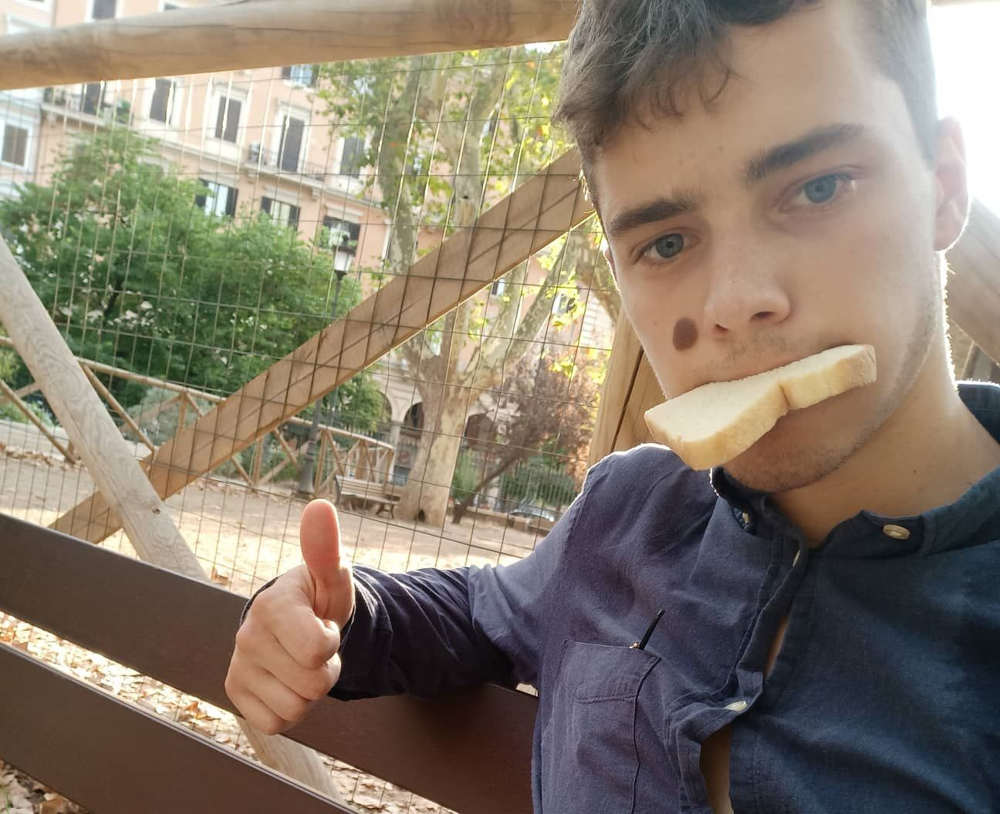
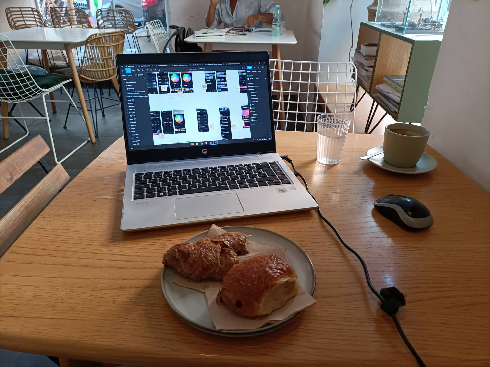
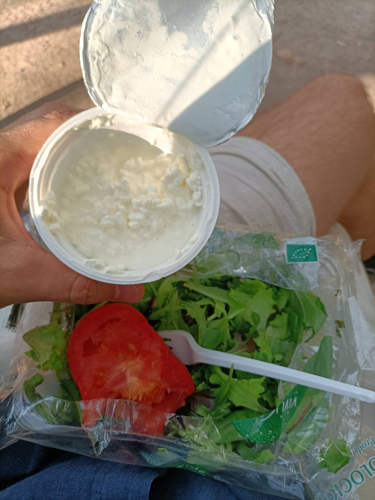
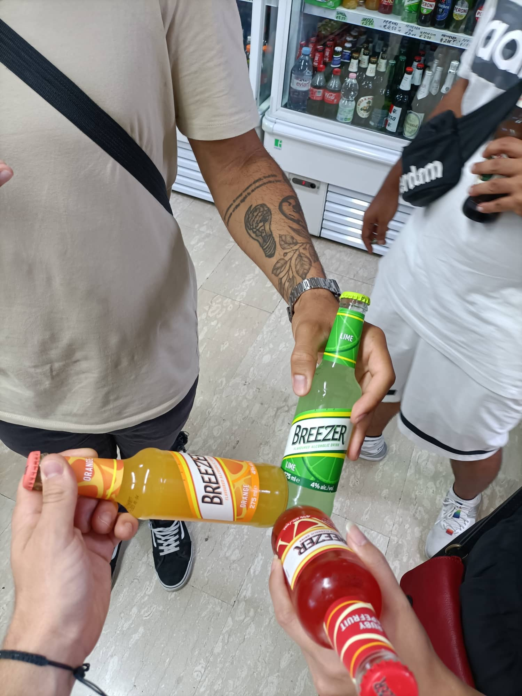
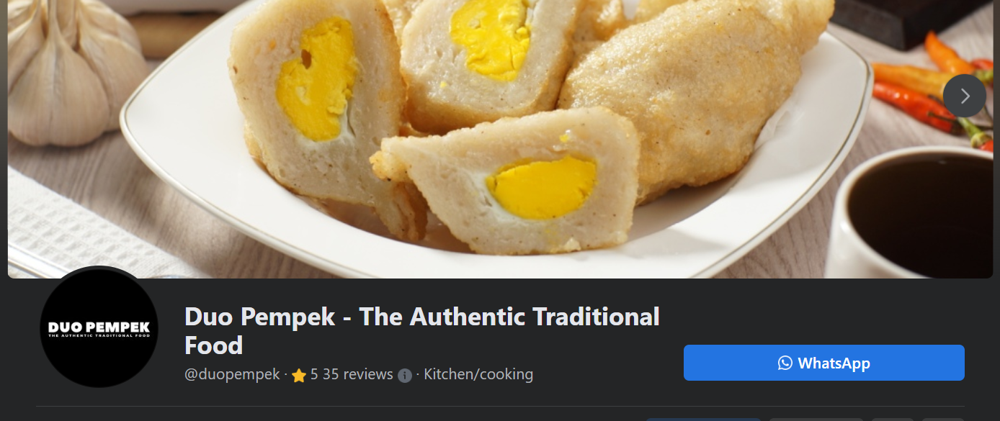
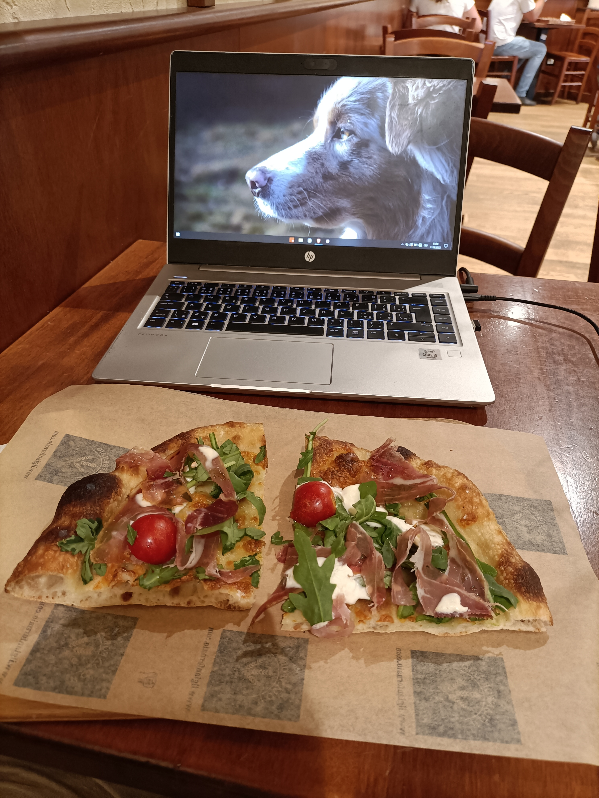

## DEN 2

### Uvězněn v kavárně

Našel jsem fajn kavárnu, ze které dokončuji CV a přemýšlím jak ho přeložím do Italštiny. Registruju se na všechny "travelers in Rome" skupiny, Couchsurfing, Yes Theory. Klepu do PC v jedné kavarničce od 8 od rána do 7 hodin večerních. Během toho obědvám Poke Bowl s pár ingrediencemi, které jsem si sice (italsky) objednal ale netušil co to bude. Bylo to s kuřetem, kešu a avokádem.

Večer mířím zpět na hostel pro zbytek potravin ze včerejška. Zjišťuju že je 7 hodin večer takže bych mohl začít řešit kde budu spát. V hostelu nemají místo dneska, zítra ani pozítří. Vyřeším to později. I guess.

### Jím zeleň v parku

V místním parku večeřuju odporný suchý salát, rajče a Fiocchi di Latte. Asi si zítra koupím olivový olej, ten salát se fakt nedá jíst. Mám na sobě úplně propocenou košili, což je mimo zpocené triko jeden ze dvou svrchních kusů oblečení, co tu s sebou mám. Vyrážím na sraz s Couchsurfery koukat na západ Slunce.

V autobuse přemýšlím že jednodušším řešením suchého salátu bude místo olivového oleje už nekupovat salát.

### Indonéská masáž

Přes Couchsurfing Hangouts potkávám lidi z Brazílie, Íránu (nyní učitelka umění v Berlíně), Indie a Německa, dáváme si italské pívo, italskou pízzu a potom jdu ke Couchsurferovi z Indonésie. Říká, že když přijdu k němu domů, tak musím být potichu, protože jeho spolubydlící nechce, ať přijímá Couchsurfery. Říká ať koupím víno, že můžeme někam zajít. Nebo tak to alespoň chápu.

Rychlé vysvětlení - co je to Couchsurfing. Surfování po gaučích. Jde o to, že když lidi cestují, tak prostě můžou napsat místním, co chtějí poznat lidi (co cestují) a poskytnout jim místo na jejich gauči (nebo na jejich manželské posteli v tomto případě 😊).

Takže dorážím na pokoj k Indonésanovi Johnovi (zvláštní jméno pro Indonésana if you ask me). Přichází jeho spolubydlící, ze kterého má John evidentně opravdu respekt. Píšeme si od teď pouze přes Whatsapp, říká mi ať jsem zticha a moc se omlouvá. Takže já mezitím píšu zážitky do blogu a sháním italské kontakty, které by mi pomohly přeložit mé curiculum vitae.

Spolubydlící zase někde odešel. Já se jdu tedy osprchovat, přicházím na pokoj a chci si číst. Spolubydlící je (asi) (zase) zpátky, takže si opět píšeme přes Whatsapp. Řešíme, že není spokojený v Římě. Málo peněz, strašidelní spolubydlící a tak. Vaří, servíruje v restauraci a dělá indonéské masáže. Pouští Netflix (ať spolubydlící asi neslyší jak ťukáme na telefonech?).

Update: nikam nepůjdeme, protože spolubydlící je stále doma. Říká, jestli nedáme víno. Odmítám a začínám se trochu bát. Nabízí mi indonéskou masáž (🤦‍♀️)

Dále si píšeme přes Whatsapp. Posílám mu moje CV a říká, že mi pomůže najít práci. Vším jeho chováním působí strašně mile. Říká mi, že mi udělá masáž krku. Říkám, že krk jo. Indonéskou masáž jsem ještě nikdy neměl.

### Indonéská masáž celého těla

Z krku se dostáváme na záda a musím říct že to fakt bodlo. Ne že bych měl moc těžký batoh, ale asi to opravdu dělá jako práci. Jde mu to. Při masáži zad mi chce trochu sundat kraťasy, a i když vím, že "tak se to při masážích dělá" tak slušně odmítám. Po zádech jdou nohy, potom krk a hlava. Je to vlastně vpohodě. Při masáži hlavy cítím jeho smradlavý dech na mém krku a dochází mi že jsem v Říme a právě mě masíruje Indonésan, kterého jsem potkal před jednou hodinou přes aplikaci Couchsurfing. Trochu se už těším, až přijde zítra.

Po masáži mi nabízí skleničku vody, já v panice říkám že nechci vodu a piju z vlastní pet lahve. Vypadá zmateně a diví se. Já taky. Asi jsem si myslel, že mě chce Indonésan John otrávit a potom se se mnou v noci mazlit.

Každopádně potom jdeme spát (vedle sebe) a on usíná celkem rychle, já asi tak až za 2 hodiny. Nebo takový mám alespoň pocit. V noci se furt budím.

### Finance po dni 2:

Kavárna - snídaně a oběd, na večeři pizza, piva. Jsme na 3000 Kč. To je polovina z 6000. Yikes

## DEN 3

### Indonésan, který zachraňuje okradnutou Němku a její dítě

Čistím zuby a jdeme s Johnem na snídani. Dáváme si croissanty (cornetti) a capuccina. Svěřuje se, že by potřeboval pomoci s jeho stránkami. Aby mohli lidi platit za Pempek (indonéské jídlo) kartou. Radím mu, ať více prodá, že to všechno dělá sám, a který má použít website builder.

Vypráví mi, jak před týdnem potkal německou matku s dítětem, které někdo okradly. V Říme si mám dát pozor na kapsáře. Prý je pozval do restaurace a poradil jim, co dělat dál a jak si nechat převést peníze od rodiny v Německu. John je evidentně dobrý člověk. Ale jeho včerejší masáž mi trochu nahnala strach. Říká, že se chce stěhovat od spolubydlícího, který mu nahání strach, a že bychom se mohli přestěhovat spolu (…), domlouváme se, že budeme v kontaktu a že mu ještě pomůžu s tím webem. A on že mi někdy udělá Indonéské jídlo (a doufám že nic dalšího).

### CV

Sedím 3h v kavárně. Dávám si pizzu s parmskou šunkou. Píšu blogísek a hledám, kde si koupím komiks, triko a kde vytisknu CVs.

