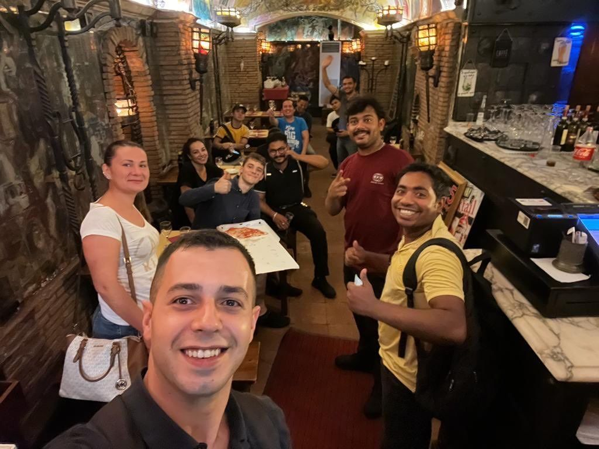
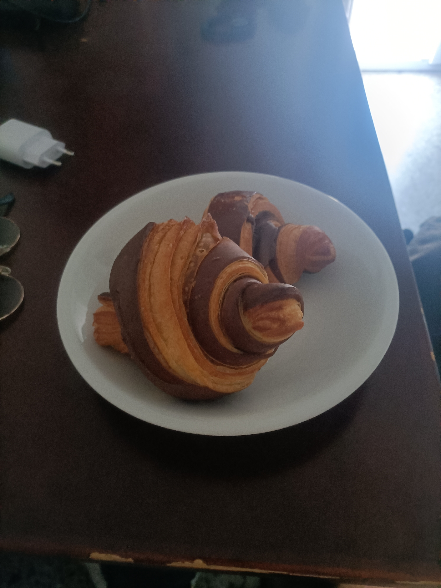

### Pár myšlenek o barmanství

Barmana experta jsem si vždycky představoval jako někoho, kdo je schopen udělat mojito za 12s. Vůbec to není o rychlosti. Právě naopak. Dobrý barman nedělá žádný zbytečný pohyb, má rozmyšleno přesně, co udělá dále a nemrhá žádnou energií. To ještě nezvládám. Buď nedělám pohyby co mám, nebo jich dělám moc a zbrkle.

### Dělat práci co tě baví je špatně

Bavím se s Raphaelem, který vysvětluje, proč nemůže(š) dělat práci, co tě baví. Když tě práce přestane bavit, tak už máš moc zainvestovaného času na to, abys toho nechal. A taky, když pracuješ, protože tě to baví, tak vyděláváš méně peněz. Když říkám, že mám plno zainvestovaného času v Česku a stejně jsem tady abych se učil italsky, nic neodpovídá.

Francesco je zhrozen z mého velkého batohu, bavíme se k mém ubytování (říkám, že spím v Airbnb za 40€/noc - vysvětlovat, proč jsem u Indonésana s masáží, polívkou a indonéským čajem by bylo na mou italštinu too much). Říká že mi najde lepší místo 🤩

### Peníze

Dostávám zaplaceno každý den po směně 70€. Nebo tak to alespoň zatím bylo první tři dny. Žádný talk o smlouvě, ale bude talk o vyšším platu (doufám). Práce je od 11:30 do 00:30 s 1:30 pauzou, tzn 11h 30m práce za 70€ = 6€ = 150 Kč. Páči sa mi, že nemusím řešit kdy mi dojde výplata a jestli vůbec kdy budu vyplacený. V posledním příspěvku jsem vynechal stav konta. Z minulých 1000 Kč něco ubylo za kola, broskve, takeaway pizzy na snídani (jinak jím v práci zadara). Ubytko do 17. neplatím (ne že bych ho od 17. platil, akorát nevím kde budu). Přibylo 3x70€ + 35€ za dižko (jak se to píše??) a bonus práce o víkendu. Bilance cca 5700. Původní vklad je skoro zpět.

### Úspěchy barmanské

V práci méně závisím na jazyku, takže performuji lépe, a dostávám pár pochval, od Francesca, Utcha i Borata. Což každopádně znamená, že nenávistné myšlenky už nejsou potřeba a na jakékoli hlubší myšlení není čas, protože řeším jak udělat tuhle objednávku, potom dalších 8, a do toho stihnout umývat sklenice a tak dále. Do toho koukám a snažím se zjistit co znamená jaké slovo, při nejhorším říkám (už sebevědomě), že jsem nerozuměl, tým už ale pochopil, že když se mnou mluví polopaticky a používají ruce více než jazyk tak ode mě dostanou co potřebují. Někdy už zvládám vyjádřit nějakou emoci. Dnes třeba Francesco trefil víčko do koše přes celý bar a já jsem plynule odpověděl "Bravo Francesco, sei incredibile" - na 6 měsíců studia italštiny celkem úspěch (ironie.)

Každopádně den se skládá ze vstanutí, cesty do práce, polední směny, hodiny a půl papací pauzy, večerní směna, cesta k Johnovi, 8h spánek. A znovu. Z mého psaní tedy teď je spíše sněť náhodných emocí než smysluplný příběh. Omlouvám se.

### Zůstávám až do prosince

Úplně mimochodem se mě během práce Francesco ptá, jak dlouho tu jsem a já říkám dva měsíce. Několikrát nevěřícně opakuje otázku, zkouší jinak formulovat (např do kdy tu budu) a já pořád odpovídám stejně (do konce září). Borat říká, jestli nezůstanu a l e s p o ň do prosince, Francesco se mě ptá, jestli všechno, co mě učil vykládal do větru (😩). Chyba, že jsme to neprobrali dříve. Asi litují, že mě přijali. Já lituju, že jsem toto nevyjasnil dříve. Chtěl jsem odjet max. 15. září, teď zpytuju svědomí, a nejradši bych byl až do 22-23 (ať "konec září" je "konec září" a ne jen "kec"). Nevím. Achjo.

### Skupinové večerní foto

Od spodní strany po směru hodinových ručiček: Francesco, jeho manželka, já, servírka z Ekvádoru, Utscho, Raphael, kuchař x3, Borat a Rajo.

Většina týmu je z Bangladéše. Mimochodem, Rajo se takhle usmívá celý den, nechápu jak to dělá. Borat je ten, co se mnou není trpělivý a Francesco můj bartender mentor, skutečná kapacita.

### Štěstí na kole

Jedu na elektrokole k Johnovi z práce, je 01 hodina ráno, jedu vedle Kolosea, mám puštěného nahlas Sinatru a zažívám naprostou rozkoš. Snažím se vystopovat, jak se tohle stalo. Co to přesně je za pocit? Co je to štěstí když zažívám toto po naprosto deadly 12h směně v Římě? Nebo je to právě proto, že jsem unavený po směně, takže je teď i klidná jízda na kole zážitek?

