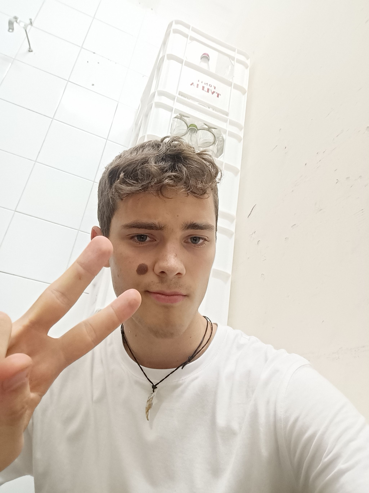
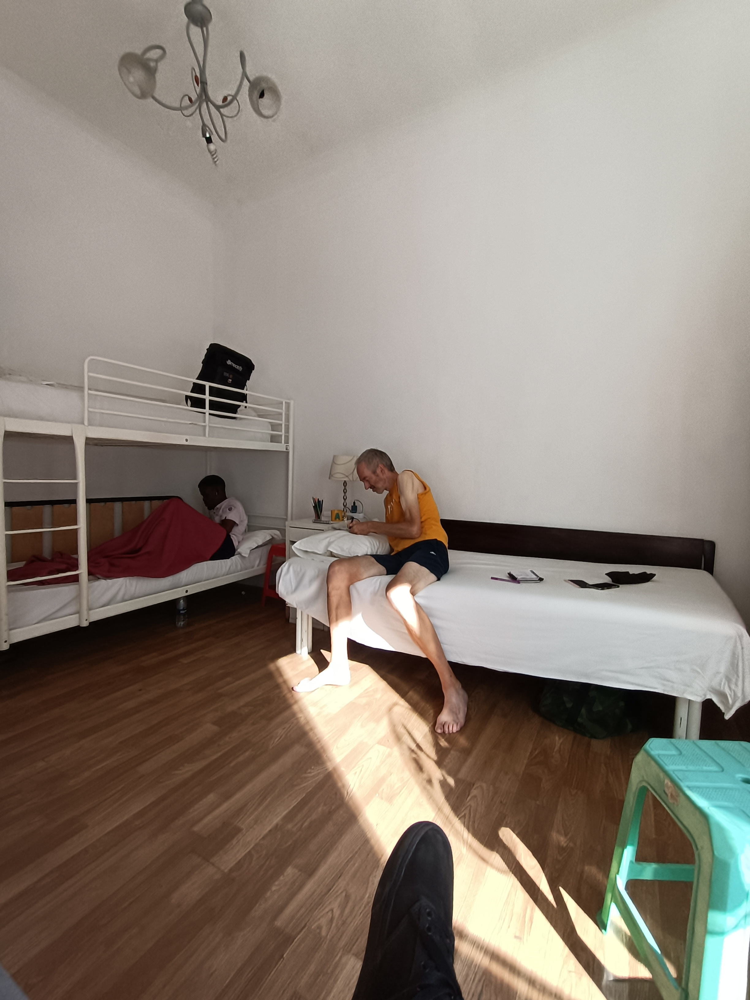
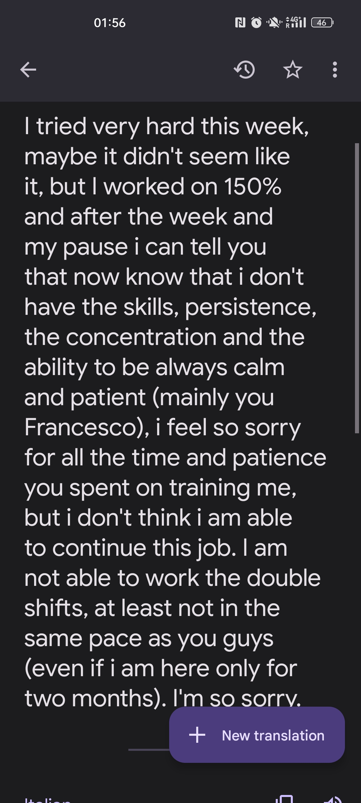

## Za rohem slza

Ptám se Utscha, co mám dělat se zbytkem citrónů, říká mi ať je vyhodím. Když je vyhazuju, zhrozeně říká, že je nemám vyhazovat. Nechápu a vysvětluje že, říkal že po "vyhoď to" říkal že "to je vtip". Haha. A já že evidentně nevím jak se řekne italsky "vtip". Zbytku to přijde vtipné. Asi chápu, mi moc ne.

Tento příspěvek nejsou dobrodružné historky ale jen "mami, stěžuju si". Tak to teď ale prostě je.

Každý den je teď jenom jeden den. Vstávání u Johna v 10:00, 30min cesty do práce (autobusem na černo, dost času na přemýšlení), prací, pauzy na oběd, prací, 30min sezením u Trevi fountain po práci (detaily v zápětí), cesty autobusem a 7h30min spánku. V pátek mě čeká první pauza. V pondělí přijede nějaké šéfka, která je prý přísnější než všichni ostatní dohromady a bude se řešit můj schedule. Mám chuť zůstat místo do "konce září", zůstat do "zítra".

## Myšlenky, hlouběji: turisti, únava, Italky

Po konci směn chodím znaven vždy k Trevi Fountain přemýšlet, co tu vlastně dělám. Mood úroveň je vždy "za rohem slza". Tento mood nastává vlastně vždycky když nejsem něčím rozptýlen. U fontány pozoruji turisty, kteří dumají nad tím, jaký úhel pro Jejich Zmocnění u fontány zvolit. Někteří dumají až 20 minut. Někteří prosí sedícího Čecha o pomoc se Zmocněním. Svou misi beru zodpovědně - beztak díky mé pomocí dostanou plno lajků od všech kamarádů, kteří neměli čas nebo peníze na cestování. Není to krásné?

Mé problémy se dělí na únavu fyzickou (nohy), mentální (dumat nad každou větou ze mě nějakým způsobem dělá ve všech intelektuálních úrovních úplného imbecila) a na pěkné Italky. To je pro nadpis. Tedy obecně všechny (mladé) co si "užívají" (dovolenou). Co neřeší. Co chodí do barů. Co se usmívají. A co tedy dělám JÁ a hlavně TADY? Proč nejsem jinde? Tam s nimi, třeba? Proč nejsem někde na pláži? Proč nejsem někde v čajovně na Stodolní? Proč nechodím po horách se psem? Proč nejsem s kamarády? Proč chci (chtěl jsem??) ve svých 21 letech dělat 12h směny za 5.3€ za hodinu, nechat po sobě řvát, být mezi lidma co se na mě dívají jako na tupce co nic nechápe? Proč jsem si tohle vybral, nebo jak jsem se tady dostal? Kde je ta jasná vize se kterou jsem tu jel? A byla to kdy jasná vize? O co šlo? Útěk od čeho? K čemu?

Představoval jsem si co? Že budu mít práci 2h denně a zbytek dne budu trajdat po Vatikánu? Nevím. Rozhodně jsem si ale nepředstavoval, že v Římě uvidím akorát Koloseum, fontánu kde se všichni fotí, a že potkám úchylné Indonésany, opilé Brazilce (ŽÁDNÝ VATIKÁN - protože celý den pracuji).

## Update k bydlení

John jede na dovolenou do Německa takže od dneška - 18. 08. - hledám jiné bydlení. John mi ale se samozřejmým výrazem říká, ať prostě spím u něho doma, ale že si mě nesmí všimnout spolubydlící. Nechává mi croissanty na snídani, klíče ve dveřích a odjíždí do Mnichova. What??!

Mám Johnovy klíče, spím ale dvě noci v hostelu. Protože jsem se tak prostě rozhodl. Zatím jsem nepřijal že mám v batohu klíče od bytu Indonésana kterého jsem potkal před TÝDNEM. Zítra mě čeká první volný den. Budu spát a přemýšlet. Hlavně přemýšlet.

## Jeden den, stále do kola

Nedokážu pochopit jak někdo takhle může žít celý život. Jako barman/číšník/kuchař. Vstaneš, servíruješ/vaříš/umýváš, trochu si postěžuješ na to, jaké věci jsou, doma koukneš na Netflix a spát. Ráno vstaneš a znovu. Asi nejde jenom o číšníky, žije takhle většina lidí. Jeden den, stále dokola. Jak?!

Zde přiložím rychlou sebereflexi, protože je mi jasné že já jsem postižený stálým hledáním nového, lesklého, lepšího, takže můj názor je, co to je. Ale řekněte mi - kde je v tomhle nějaký život? To je akorát opakování jednoho dne furt do kola! Nerozumím!

Po téhle zkušenosti tyhle lidi asi už místo (dřívějšího) pohrdání obdivuju. Mají něco, co já ne. Umí něco, co já nikdy nedokážu. Funguju takhle 7 BLBÝCH DNÍ a nezvládám. Francesco takhle žije už 12 let. WHAT???

## VOLNO!!!!

Jak jsem už nastínil, ač to nedokážu zdůvodnit, mám pocit, že mě týden v italské restauraci úplně zblbnul. Mám pocit, že nedokážu normálně skládat myšlenky, slova, motivace, emoce. Jsem naštvaný sám na sebe, na vlastní myšlení a pocity. Myšlenky a slova co z nich vznikají nemají hlavu a patu. Stále si stěžuju. A potom mě štve, že si stěžuju.

A taky mě furt něco svědí. To je život.

## Volný den

V noci po posledním dni práce před dnem volna potkávám u Trevi fountain dvě Tunisky, Portugalce a Maročana. (Opět) jsem požádán o udělání skupinového fota a potom mě zvou na pivo. Jdu tedy na jedno pivo a je to hrozné. Všichni čučí před sebe a čekají, až někdo řekne něco zajímavého, nebo až se opijou a sami budou zajímaví, nebo veškeré ne-dění bude samo o sobě zajímavé. Konverzace formální, plochá. V pokusu zlepšit atmosféru navrhuju, ať mi zazpívají všechno nejlepší, i když nemám narozeniny, že se možná přidá zbytek baru. Zpívají, a zbytek baru se přidává. Přidává se i zpěvák s mikrofonem a kytarou. Všem se to moc líbí. Po jednom Heinekenu a narozeninové písničce jedu do hostelu. Tam potkávám občana, který na větu "odkud jsi" anglicky odpovídá "to není důležité".

## Východisko z nespokojenosti

Průměrně inteligentní čtenář si asi řekne "když tě ta práce tak nebaví nebo co, tak z ní odejdi, nebo řekni si o změnu hodin, pracovat každý den dvojitou směnu asi není normální". Tomuto průměrně bystrému čtenářovi se klaním, protože ve svém přemýšlení jsem se za uplynulý týden nedostal. Po dni volna vítězoslavně vykřikuji, že jsem tohoto čtenáře DOHNAL!

Řešení zdánlivě nejjednodušší, odejít a nevracet se. Díky faktu, že dostávám zaplaceno v eurech po konci směny, asi nejrychlejší a nejpřímočařejší řešení. Objevuji ovšem, že mám nějaké svědomí. Tohle řešení totiž nepřichází absolutně vůbec v úvahu. Byl bych více schopen pracovat do prosince každý den 12h než abych něco takového udělal. Nelogické. Zajímavé. Jdeme dál.

Je tedy třeba konfrontovat vedení, a probrat možnosti. Vzhledem k tomu jak nerad konfrontuji, a ještě kvůli tomu, jak nerad konfrontuji v italštině, je toto řešení velmi nepříjemné. Je ale potřeba.

Dnes tedy jdu na to.

## Východisko: končím s prací, ale férově

Dopolední směnu pracuju pln energie a všem radostně říkám, jak jsem si skvěle odpočinul (chce se mi spát více než ten týden, co jsem neměl volno). V hlavě chaos, na obličeji úsměv. Kučera hrdina, klasika.

Pozdní část odpolední směny jde rychle z kopce, protože místo mojita bez alkoholu dětem servíruju mojito s 4s rumu (to je prosím barmanská jednotka, možná díky takovým těm nasazovátkám na láhev - sekundy), nebo dělám mojita bez máty, pracuju pomalu. Borat mi říká hodinu před koncem směny ať jdu domů. To by ale znamenalo, že nebudu mít čas na promluvení. Jdu si sednout dolů a hodlám hodinu čekat než se skončí.

Pro někoho běžná zkušenost - promluvit si o práci, pro mě dobrodružství na úrovni nelegálního přespávání v hotelu.

Trochu se uklidňuji salátem, tuňákem a koncertem od Čajkovského a píšu zprávu pro Francesca.

Na konci směny se mě Borat ptá, jestli chci zítra dělat dvojitou směnu, v panice odpovídám ano (?????), a čekám až se všichni rozejdou, abych šel za Francescem. Říkám mu, že jsem mu napsal zprávu, ten mi ale říká, že veškeré plánování je na Boratovi, jdu tedy nervózně za ním. Čte, říká ať přijdu zítra na poslední dvojitou směnu, potom budu dělat jen večery. Takže happy ending? Copak to bylo tam jednoduché? Proč to stálo tolik prosezených minut u Fontány? To si nejsem schopen přiznat, že mi něco nejde? Nerad lidi "zklamávám"? Neumím s lidmi mluvit upřímně?

Konec tedy polootevřený, zítra tedy poslední dvousměna (??)

Za psaní tohodle příspěvku jsem rozkousal 3 plastová brčka. A taky jsem zjistil že jsem právě psal 1:30 blog a je 02:30. Chtěl jsem spát u Johna ale asi radši zkusím chodit po hotelech, jestli nemají volný pokoj 🤦‍♂️

Moc děkuji všem 5 čtenářům. Zejména těm, kteří dají vědět o tom, že se jim to líbí, nebo nelíbí, nebo že je něco pobavilo a tak dále. Za reakce prostě. Baví mě psát, ale ještě zábavnější je na to číst reakce. Ať to je "jsem v slzách, to je jízda" nebo "píše se to dýžko" (pokazil jsem to zase?)
